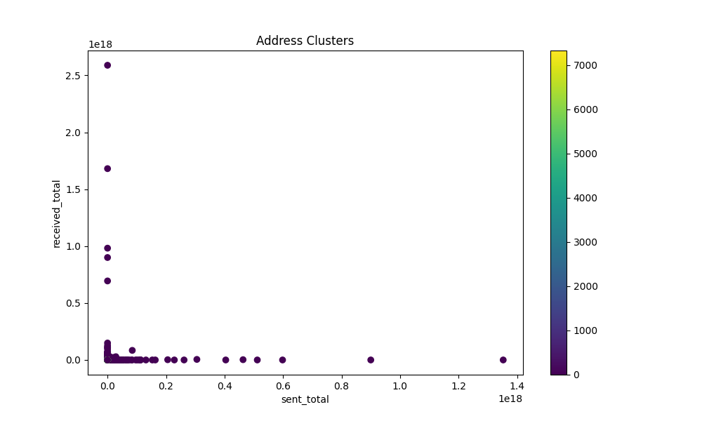
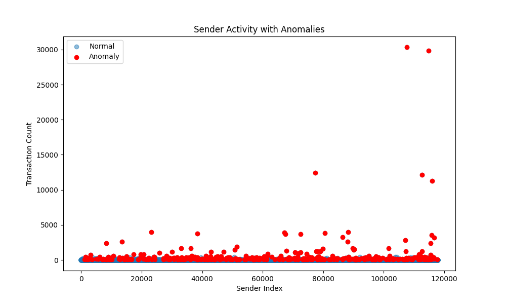
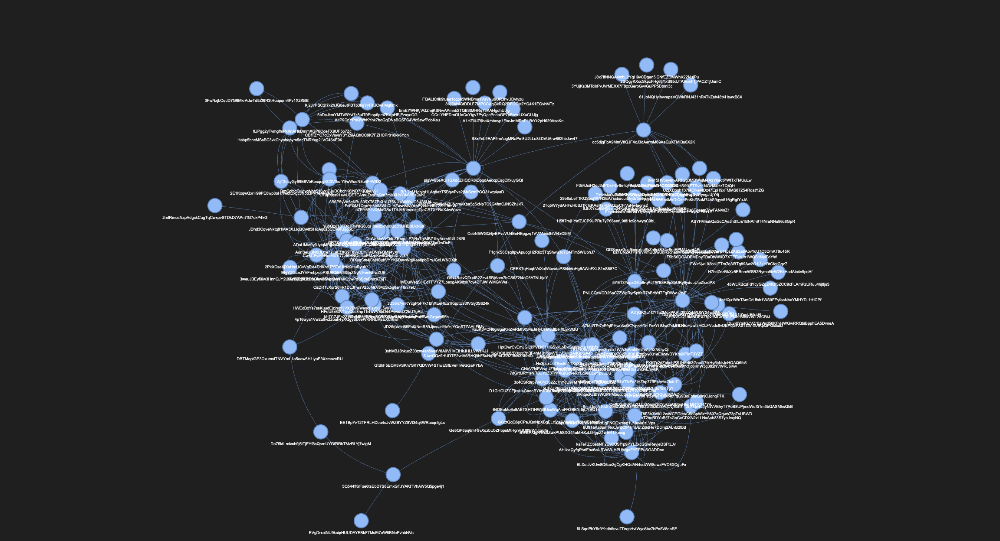

# Blockchain Transaction Analysis Report

This document provides a comprehensive analysis of blockchain transaction behavior, organized into three main sections: Clustering & Address Profiling, Anomaly Detection, and Network Analysis.

---

## Table of Contents
1. [Clustering & Address Profiling](#clustering--address-profiling)
2. [Anomaly Detection](#anomaly-detection)
3. [Network Analysis](#network-analysis)
4. [Conclusion](#conclusion)

---

## 1. Clustering & Address Profiling 

### Overview
The objective of clustering in this context is to group blockchain addresses based on their transaction behavior. This includes identifying frequent transactors, large-value movers, inactive accounts, and other distinct behavior patterns.

### Clustering Methodology
- **Objective**: Group addresses by transaction behavior.
- **Suggested Algorithms**:  
  - **HDBSCAN**: Effectively identifies outliers and diverse behaviors.  
  - **KMeans**: Can segment data but may struggle with outlier detection due to high intra-cluster variance.

### High-Level Observations
- **Cluster Count**: The dataset contains multiple clusters, including a special outlier cluster (Cluster -1) representing addresses not neatly fitting into defined groups.
- **Behavior Diversity**: Some clusters exhibit highly active transaction profiles (thousands of transactions) while others represent inactive or zero-sum behaviors.

### Key Cluster Profiles

#### Cluster -1: Outliers
- **Size**: 29,015 addresses (largest cluster)  
- **Metrics**:
  - **Avg Sent Transactions**: 10.23  
  - **Avg Received Transactions**: 9.65  
  - **Avg Sent Value**: 2.71 × 10¹⁴ tokens  
  - **Avg Received Value**: 3.35 × 10¹⁴ tokens  
  - **Total Transactions**: 7.88 × 10¹⁸ sent, 9.73 × 10¹⁸ received  
- **Interpretation**:  
  Likely represents large crypto exchanges, high-volume smart contracts, or high-frequency trading bots.

#### Cluster 1: High Transaction Volume, Large Movers
- **Size**: 45 addresses  
- **Metrics**:
  - **Avg Sent Transactions**: 2.44  
  - **Avg Sent Value**: 4.54 × 10¹⁶ tokens  
  - **Avg Received Transactions**: 0.044 (very low)  
  - **Avg Received Value**: 1.69 × 10¹² tokens  
  - **Total Transactions**: 2.04 × 10¹⁸ sent, 7.60 × 10¹³ received  
- **Interpretation**:  
  These addresses are likely institutional wallets, smart contract payout accounts, or large traders predominantly sending funds.

#### Cluster 2: High-Frequency Trading Bots
- **Size**: 8 addresses  
- **Metrics**:
  - **Avg Sent Transactions**: 1,570.75  
  - **Avg Sent Value**: 3.19 × 10¹³ tokens  
  - **Avg Received Transactions**: 15.37  
  - **Avg Received Value**: 6.69 × 10¹¹ tokens  
  - **Total Transactions**: 2.55 × 10¹⁴ sent, 5.35 × 10¹² received  
- **Interpretation**:  
  Indicative of market-making bots, liquidity providers, or algorithmic traders executing thousands of transactions.

#### Cluster 3: Mid-Sized Traders and Frequent Transactors
- **Size**: 15 addresses  
- **Metrics**:
  - **Avg Sent Transactions**: 1,027.33  
  - **Avg Sent Value**: 1.29 × 10¹³ tokens  
  - **Avg Received Transactions**: 24.06  
  - **Avg Received Value**: 7.48 × 10¹³ tokens  
  - **Total Transactions**: 1.94 × 10¹⁴ sent, 1.12 × 10¹⁵ received  
- **Interpretation**:  
  Likely includes active day traders, small liquidity pools, or treasury wallets managing funds.

#### Cluster 0: Unusual Low Activity but High Inflows
- **Size**: 9 addresses (smallest cluster)  
- **Metrics**:
  - **Avg Sent Transactions**: 0 (no outgoing activity)  
  - **Avg Received Transactions**: 9,026.22  
  - **Avg Sent Value**: 0 tokens  
  - **Avg Received Value**: 2.21 × 10¹⁰ tokens  
  - **Total Transactions**: 0 sent, 1.98 × 10¹¹ received  
- **Interpretation**:  
  These addresses likely represent deposit-only accounts (such as those used by centralized exchanges), smart contract vaults, or dormant/blacklisted accounts.

### Clustering Algorithm Performance

#### HDBSCAN Insights
- **Effectiveness**: Naturally handles outliers (Cluster -1) and distinguishes between diverse behaviors such as high-frequency trading (Cluster 2) and institutional movers (Cluster 1).
- **Advantage**: Does not force all data points into clusters, providing a more realistic segmentation.

#### KMeans Considerations
- **Limitations**:  
  - Tends to create arbitrary clusters with high intra-cluster variance.
  - Less effective in detecting outliers, potentially merging large-value movers with typical users.

### Key Takeaways
- **Address Classification Summary**:

  | Cluster | Type of Addresses                 | Key Characteristics                                |
  |---------|-----------------------------------|----------------------------------------------------|
  | -1      | Outliers (Exchanges, Smart Contracts)  | Massive volumes; extremely active                |
  | 0       | Deposit-Only Addresses            | High inflows, zero outgoing transactions           |
  | 1       | Institutional Movers              | Large, predominantly outgoing transactions         |
  | 2       | High-Frequency Traders            | Thousands of transactions with small inflows       |
  | 3       | Mid-Sized Traders                 | Regular activity with balanced in/out flows        |

- **Behavioral Insights**:
  - Most addresses fall into Cluster -1 (highly active or exchange-related).
  - Clusters 2 and 3 indicate active trading behaviors.
  - Cluster 0 suggests passive receivers or specialized deposit addresses.

---

## 2. Anomaly Detection 

### Overview
This section identifies outliers in the blockchain dataset—both in terms of transaction amounts and frequency—using machine learning and statistical methods.

### Detailed Analysis of Anomalous Transactions

#### Top Anomalous Transactions

1. **Largest Anomalous Transaction**
   - **Sender**: `HFxqBth4nwsZCBuyJLSiFQCWNTFpN4xGjzGEkp8PyYMA`
   - **Recipient**: `5Q544fKrFoe6tsEbD7S8EmxGTJYAKtTVhAW5Q5pge4j1`
   - **Amount**: 1.35 Quadrillion tokens  
   - **Transaction Count**: 1  
   - **Insights**:  
     - Could represent an exchange deposit, a liquidity injection into a protocol, or a whale transfer.

2. **Second-Largest Anomalous Transaction**
   - **Sender**: `6cm6GNDt8CJu3itZrYdXzHamsg59vJNkcZX7E4mfR3qX`
   - **Recipient**: `C5rA8AJLuyBKems2rhAV5C7HFsuGa4feTakChYa2GUC4`
   - **Amount**: 900 Trillion tokens  
   - **Transaction Count**: 1  
   - **Insights**:  
     - May be an attempt at price manipulation or a one-off large fund movement.

3. **Third-Largest Anomalous Transaction**
   - **Sender**: `93itCQ64uAwYkT5yb87Ly3kCpjdNKQpKkdJse23rQB5A`
   - **Recipient**: `GpMZbSM2GgvTKHJirzeGfMFoaZ8UR2X7F4v8vHTvxFbL`
   - **Amount**: 404 Trillion tokens  
   - **Transaction Count**: 1  
   - **Insights**:  
     - Represents a significant transfer, potentially from an institutional source.

4. **Recurring Anomalous Transactions**
   - **Observation**:  
     - The recipient address **5Q544fKrFoe6tsEbD7S8EmxGTJYAKtTVhAW5Q5pge4j1** appears multiple times, indicating its potential role as a central hub (e.g., an exchange or protocol address).

### Anomalous Activity Based on Transaction Volume

#### Detailed Analysis of High-Frequency Sender Activity

| **Sender Address**                                     | **Transaction Count** | **LOF Anomaly Score** |
|--------------------------------------------------------|-----------------------|-----------------------|
| `Habp5bncMSsBC3vkChyebepym5dcTNRYeg2LVG464E96`           | 30,358                | -1                    |
| `fLiPgg2yTvmgfhiPkKriAHkDmmXGP6CdeFX9UF5o7Zc`           | 29,861                | -1                    |
| `DBTMopiGE3CxumsfTNVYmL1a5eaw5H1iyaE3XzmozxRU`           | 12,423                | -1                    |
| `Mt7CZJFn2ZmDvMb2dBBcs3KGfXGJqUz6grsvtwxEnkP`           | 12,148                | -1                    |
| `pigVv65eXGHGXdcZHQCR8iDpqdAeccpEqgCifxuyGQt`           | 11,243                | *(Implied)*         |

**Insights**:
- These senders are transacting at volumes far exceeding normal behavior, strongly indicating automated trading, liquidity provisioning, or even potential spam attacks.

### Anomaly Detection Methods

#### Machine Learning Approaches
- **Isolation Forest (IF)**
  - **Purpose**: Identifies amount anomalies by isolating transactions that require fewer splits.
  - **Outcome**: Flagged transactions with exceptionally high values (e.g., the 1.35 quadrillion tokens transfer).

- **Local Outlier Factor (LOF)**
  - **Purpose**: Detects outliers based on the density of sender activity.
  - **Outcome**: Highlighted addresses with extremely high transaction counts.

#### Statistical Methods (Considered)
- **Z-Score Analysis**
  - Measures how many standard deviations a transaction deviates from the mean.
- **Interquartile Range (IQR)**
  - Flags transactions or sender counts that fall outside 1.5 times the IQR.

### Final Takeaways
- **Amount Anomalies**:  
  - Extremely high-value transactions suggest exchange movements, institutional investments, or even illicit transfers.
- **Activity Anomalies**:  
  - High-frequency senders (likely automated bots or smart contracts) deviate markedly from normal transaction patterns.
- **Methodological Synergy**:  
  - Combining machine learning (Isolation Forest, LOF) with statistical methods (Z-score, IQR) provides a robust framework for anomaly detection.

---

## 3. Network Analysis

### Overview
This section analyzes the blockchain transaction graph to reveal network properties such as degree and betweenness centrality, connected components, and the identification of key hub addresses.

### Network Graph Construction & Structure
- **Graph Structure**:  
  - A dominant main component comprising most addresses, with a few smaller or isolated sub-networks.

### Degree Centrality
- **Definition**: The number of direct connections (edges) an address has.
- **Key Observations**:
  - `5Q544fKrFoe6tsEbD7S8EmxGTJYAKtTVhAW5Q5pge4j1`: Exhibits very high degree centrality.
  - `Habp5bncMSsBC3vkChyebepym5dcTNRYeg2LVG464E96`: Consistently appears among the top nodes.
  - `E2BhMqW4yfSf1B9ipFn5jGgQGns6EyD1LpqThpYfEhTx`: Also ranks high, indicating broad connectivity.
  - Additional addresses (e.g., `96gYZGLnJYVFmbjzopPSU6QiEV5fGqZNyN9nmNhvrZU5`, `ErSA78neCerDQVWbVUMm9LiQbEkkFKfmy6tCh3LxMKZx`) have moderate connectivity.

### Betweenness Centrality
- **Definition**: Measures how often an address lies on the shortest path between other addresses.
- **Key Observations**:
  - `fLiPgg2yTvmgfhiPkKriAHkDmmXGP6CdeFX9UF5o7Zc`: High betweenness, acting as a bridge between clusters.
  - `11CFe3GWVF29T1ppPsJeSRc3Luhg5E9FUM1qVEGGrCX`: Frequently connects distinct network clusters.
  - `1212UMAW7zdJiKshVfs2ZktxdRoUkhmdBuTHQPUQ8PbL`: Plays a moderate bridging role.

### Hub Addresses: Most Influential Nodes
- **Identified Hubs (based on hub_value)**:
  - `5Q544fKrFoe6tsEbD7S8EmxGTJYAKtTVhAW5Q5pge4j1` – hub_value ≈ 0.1859
  - `Habp5bncMSsBC3vkChyebepym5dcTNRYeg2LVG464E96` – hub_value ≈ 0.1144
  - `fLiPgg2yTvmgfhiPkKriAHkDmmXGP6CdeFX9UF5o7Zc` – hub_value ≈ 0.1143

### Interpreting the Roles of Key Addresses
- `5Q544fKrFoe6tsEbD7S8EmxGTJYAKtTVhAW5Q5pge4j1`:  
  - Acts as a central hub with extensive direct connections. Its removal would significantly disrupt network connectivity.
- `Habp5bncMSsBC3vkChyebepym5dcTNRYeg2LVG464E96`:  
  - Though not as central as the first node, it maintains high influence through direct links.
- `fLiPgg2yTvmgfhiPkKriAHkDmmXGP6CdeFX9UF5o7Zc`:  
  - Plays a key bridging role, connecting multiple network subgroups.
- **Supporting Bridges**:
  - `11CFe3GWVF29T1ppPsJeSRc3Luhg5E9FUM1qVEGGrCX` and `1212UMAW7zdJiKshVfs2ZktxdRoUkhmdBuTHQPUQ8PbL` are also critical in linking otherwise separated clusters.

### Final Takeaways
- **Top Hubs/Influencers**:
  - `5Q544fKrFoe6tsEbD7S8EmxGTJYAKtTVhAW5Q5pge4j1` 
  - `Habp5bncMSsBC3vkChyebepym5dcTNRYeg2LVG464E96` 
  - `fLiPgg2yTvmgfhiPkKriAHkDmmXGP6CdeFX9UF5o7Zc`
- **Bridging Nodes**:
  - `11CFe3GWVF29T1ppPsJeSRc3Luhg5E9FUM1qVEGGrCX`
  - `1212UMAW7zdJiKshVfs2ZktxdRoUkhmdBuTHQPUQ8PbL`
- **Network Impact**:  
  The removal or disruption of any key hub could drastically alter the overall connectivity of the network.

---

## Conclusion

### Comprehensive Findings
1. **Clustering & Address Profiling**  
   - **7,300+** clusters reflect a rich and varied ecosystem, from near-dormant addresses to massive-volume, high-frequency participants.  
   - The **largest single cluster** (-1) contains over **29k** addresses, with multiple addresses sending or receiving on the order of **10^18** tokens.  
   - Several addresses exhibit exclusively outgoing or incoming flows at extraordinary levels.

2. **Anomaly Detection**  
   - **Activity Anomalies**: ~430 flagged addresses can have transaction counts in the tens of thousands (peaking at 30,358). Such wallets likely represent bots or major service nodes.  
   - **Amount Anomalies**: Over **6,000** single transfers flagged as abnormally large; multiple transfers exceed **10^17** to **10^18** tokens. A few addresses, notably `5Q544fKrFoe6tsEbD7S8EmxGTJYAKtTVhAW5Q5pge4j1`, repeatedly show up as a recipient in these massive transfers.

3. **Network Analysis**  
   - **Sparse but Weighted**: Most addresses connect minimally, but a handful (e.g., `5Q544fKrFoe6...`, `Habp5bncMSsB...`, `fLiPgg2yTvmg...`) dominate degree and hub metrics.  
   - **Bridging Addresses**: Nodes such as `DBTMopiGE3Cx...` and `8fGopgmfKQFD...` hold top betweenness centrality, linking different parts of the network.  
   - **Influential Hubs**: The same addresses appear repeatedly in high-degree, high-hub-value categories, reinforcing their central importance in both volume and connectivity.

### Assumptions & Future Direction
- **Data Scope**: All findings assume complete coverage of this segment of the chain. External factors (price volatility, external markets) could further explain some anomalies.  
- **Token Valuation**: Amounts are in token units; real-world monetary values depend on each token’s market price.  
- **Recommended Next Steps**:  
  1. **Temporal Correlation**: Match anomalies with timestamps (market events, exchange listings, etc.).  
  2. **Deeper Cluster Drilling**: Explore smaller clusters with moderate values or specialized usage patterns (e.g., smart contract interactions).  
  3. **Address Triangulation**: Investigate addresses that appear in both frequent-activity and large-amount anomalies for potential operational or security insights.